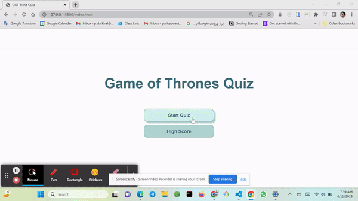

# Trivia Quiz - Game of Thrones Edition

Welcome to the Trivia Quiz - Game of Thrones Edition! This is a timed multiple choice quiz designed to challenge your memory about the TV series Game of Thrones. You will have 30 seconds to answer 3 question, and your score will be based on the number of correct and incorrect answers.

[Visit Deployed Webpage](https://parisadarkhal.github.io/Trivia-Quiz/)

---

## How to Play

1. Click on the "Start Quiz" button to begin the game.
2. You will be directed to a page where random multiple-choice questions are displayed.
3. A timer will start to count down from 30 seconds.
4. Choose your answer from the options.
5. If your answer is correct, the message "Correct" will be displayed for 2 seconds and 10 points will be added to your score.
6. If your answer is wrong, the message "Wrong" will be displayed for 2 seconds and 5 points will be subtracted from your score.
7. When you have answered 3 questions or the timer reaches 0, the game will stop and you will be asked to click to see the results.
8. Click on the button to see your results.
9. You will be directed to the highscore page, where you will be asked to enter your name in an input field.
10. The "Save" and "Play Again" buttons will be disabled until you enter a name.
11. After you enter your name, the "Save" and "Play Again" buttons will be enabled.
12. Click on "Save" to save and display your name and score in the high score field below.
13. Only the highest 5 scores are shown in the high score field.
14. Click on "Play Again" to start a new game.

\*\*\*

## Technologies Used

This project was built using HTML, CSS, JavaScript, and jQuery.

---

## How to Run the Project Locally

1. Clone the repository to your local machine.
2. Open the index.html file in your browser.
3. Start playing the Trivia Quiz - Game of Thrones Edition!

---

## Credits

This project was created by Parisa Darkhal for the purpose of practicing web development skills. The questions and answers were sourced from the website below.

[Questions Source](https://www.mentimeter.com/templates/p/competition-game-of-thrones)
